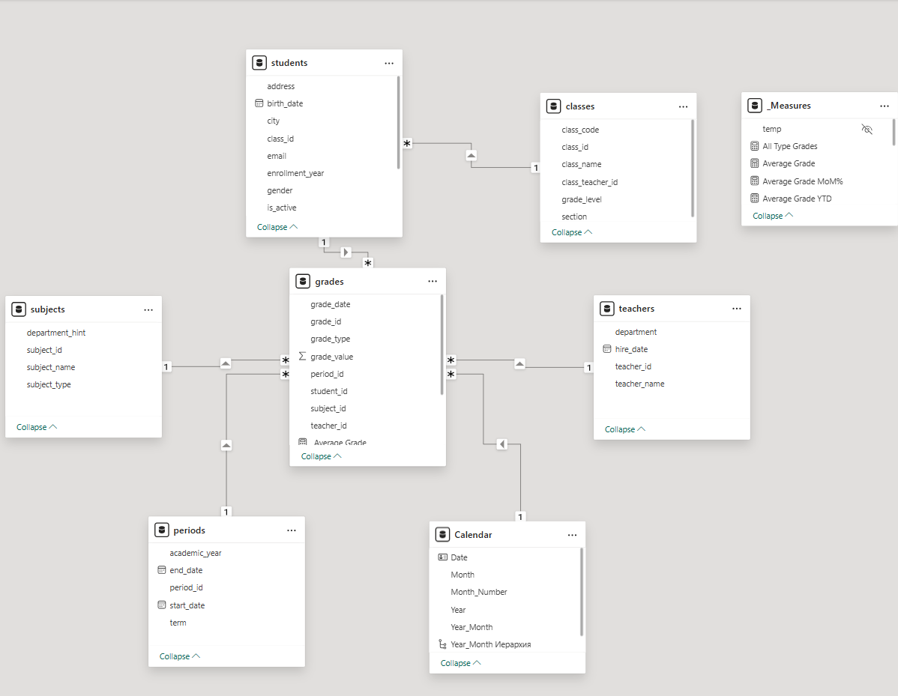

# Stage 1: Data Model (HW9)

## Objective

Complete the full data preparation cycle in Power BI: from raw CSV imports
through Power Query cleaning to building a proper star schema model.

## What was done

- Imported CSV files: `students`, `classes`, `subjects`, `teachers`,
  `grades`, `periods`
- Power Query transformations:
  - Data type normalization
  - Date format standardization
  - NULL value handling
  - Column renaming for clarity
- Created a custom `Calendar` table for time intelligence
- Built **star schema**:
  - **Fact table**: `grades` (1,700 rows)
  - **Dimension tables**: students, classes, subjects, teachers, periods, Calendar
- Configured 1:N relationships with proper cardinality

## Screenshots

### Star Schema Model View

The model uses a star schema with `grades` as the central fact table,
connected to 5 dimension tables. The `classes` table is connected via
`students` (snowflake-like extension).

## Files

- `HW9_data_model.pbix` — Power BI file
- `screenshots/` — visual documentation
