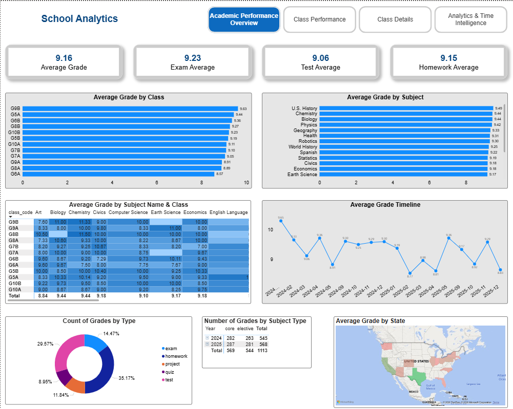

# Stage 2: Visualizations (HW10)

## Objective

Create a comprehensive analytical sheet in Power BI that combines different
visualization types, properly configured filters, and chart interactions.

## What was done

- **KPI cards**: Average Grade, Exam Avg, Test Avg, Homework Avg
- **Horizontal bar chart**: Average Grade by Class
- **Horizontal bar chart**: Average Grade by Subject
- **Heatmap (matrix)**: Average Grade by Subject x Class with conditional formatting
- **Line chart**: Average Grade Timeline across academic years
- **Donut chart**: Count of Grades by Type (with percentages)
- **Pivot table**: Number of Grades by Subject Type (core / elective)
- **Map visualization**: Average Grade by State (US geography)
- Configured **slicers** and **cross-filtering** between visuals

## Screenshots

### Academic Performance Overview

The main analytical sheet combines KPI cards at the top, comparative bar charts
for classes and subjects, a class-subject heatmap, time trends, grade type
distribution, and a geographic view by state.

## Files

- `HW10_visualizations.pbix` — Power BI file
- `screenshots/` — visual documentation
