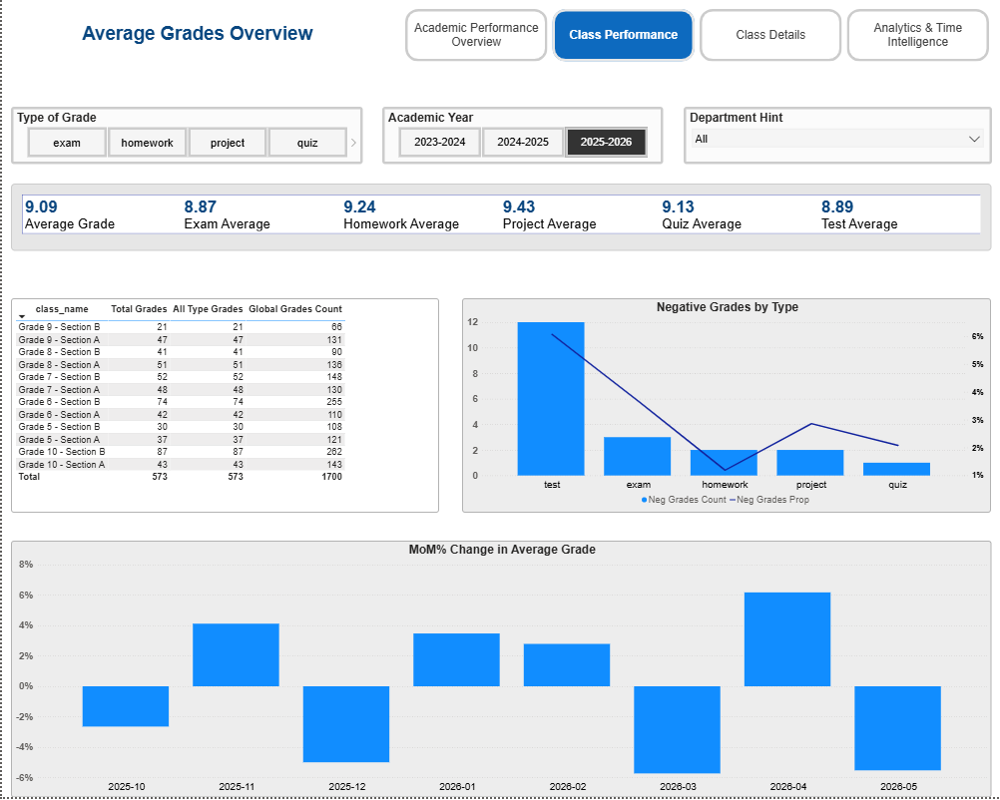

# Stage 3: DAX Measures & Drill-Through (HW11)

## Objective

Create DAX measures with various filter context behaviors, build functional
analytical sheets with interactions, and implement custom tooltips and
drill-through detail pages.

## What was done

- **8 key DAX measures** organized in the `_Measures` service table
- **Filter context manipulation**: CALCULATE, REMOVEFILTERS, ALL
- **Time intelligence**: TOTALYTD, DATEADD, MoM%
- **Negative grades analysis** for at-risk identification
- **Custom tooltip page** showing Previous Grade, Average Grade, MoM_AG%
- **Drill-through** from class-level to detailed monthly breakdown

## DAX Documentation

Full DAX measure documentation with explanations:
[**dax_measures.md**](./dax_measures.md)

## Screenshots

### Class Performance Sheet

### Tooltip Detail
The tooltip shows month-by-month detail with Previous Grade, Average Grade,
and MoM_AG% values for context analysis.

## Files

- `HW11_dax.pbix` — Power BI file
- `dax_measures.md` — measure documentation
- `screenshots/` — visual documentation
