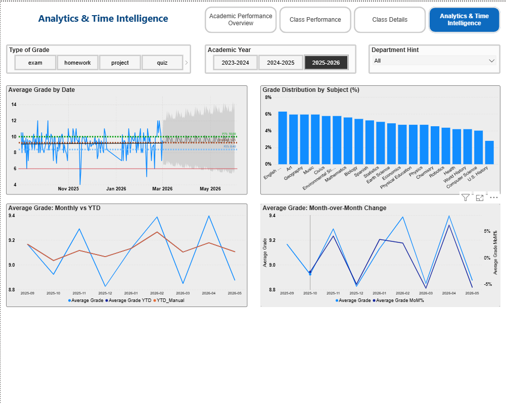

# School Performance Analytics — Power BI Dashboard

> End-to-end Power BI project: from raw CSV data to an interactive dashboard
> with time-intelligence forecasting, drill-through analytics, and navigation.


---

## Author

**Yulia Kobzeva** | Data Analyst
June 2026
Final course project

---

## Project Goal

Build an analytical system for school administration that enables monitoring
student performance across classes, subjects, regions, and time — and helps
identify students who require additional attention.

### Key business questions answered:

- How does the average grade change over time — is there a positive trend?
- Which subjects and classes show the best / worst results?
- Which students need additional attention (at-risk groups)?
- How are grades distributed across months, regions, and grade types?
- What can we expect in upcoming periods (forecast)?

---

## Project Structure

The project consists of 4 sequential stages, each in its own folder:

| # | Stage | What was done | Folder |
|---|-------|---------------|--------|
| 1 | **Data Model** | CSV import to Power Query cleaning to star schema | [01-data-model](./01-data-model/) |
| 2 | **Visualizations** | Analytical sheet with charts, filters, interactions | [02-visualizations](./02-visualizations/) |
| 3 | **DAX Measures** | Filter context, tooltips, drill-through | [03-dax-measures](./03-dax-measures/) |
| 4 | **Final Dashboard** | Time intelligence, forecasting, navigation | [04-final-dashboard](./04-final-dashboard/) |

---

## Dashboard Preview

### Final Dashboard — Analytics & Time Intelligence


### Academic Performance Overview


### Class Performance with Drill-Through


---

## Data Model

The project uses a **star schema** with one fact table (`grades`) and six
dimension tables. A separate `_Measures` table stores all DAX measures.


### Tables overview

| Table | Type | Description |
|-------|------|-------------|
| **grades** | Fact | All student grades with metadata |
| **students** | Dimension | Student info: city, gender, enrollment year |
| **classes** | Dimension | Class info: code, name, grade level, section |
| **subjects** | Dimension | Subject info: name, type (core / elective), department |
| **teachers** | Dimension | Teacher info: name, department, hire date |
| **periods** | Dimension | Academic periods: year, term, start/end dates |
| **Calendar** | Date | Custom date table for time intelligence |
| **_Measures** | Service | Centralized storage of DAX measures |

### Dataset stats

- **1,700 grades** across 3 academic years
- **120 students**
- **3 academic years**: 2023-2024, 2024-2025, 2025-2026
- **5 grade types**: exam, homework, project, quiz, test
- **2 subject types**: core, elective

---

## Key Insights

After analyzing the data, several findings emerged that help school administration
make data-driven decisions:

### Performance Leaders
- **Overall school average**: **9.16** (on a 12-point scale)
- **Top-performing class**: **G9B** with average grade **9.63**
- **Top subject**: **U.S. History** (9.49), followed by Chemistry and Biology (9.44)

### Areas Requiring Attention
- **Lowest-performing class**: G6A (~8.57) — 1+ point below leaders
- **Lowest subjects**: Earth Science (9.17), Economics (9.18)

### Grade Type Distribution

| Grade Type | Share | Avg Grade |
|-----------|-------|-----------|
| Exam | 35.17% | 9.23 |
| Homework | 29.57% | 9.15 |
| Test | 14.47% | 9.06 |
| Quiz | 11.84% | 9.16 |
| Project | 8.95% | 9.06 |

### Time-Based Trends
- **Highest MoM growth**: **+31.94%** in March 2025
- **Steepest drop**: -25.58% in January 2025 (post-winter break effect)
- **Forecast**: positive trend continues into mid-2026 with grades approaching 10.0

---

## DAX Measures

The project implements **8 key DAX measures** covering four categories:
basic aggregations, time intelligence, filter context manipulation,
and grade-type segmentation.

### Highlights

```dax
-- Average grade with safe aggregation
Average Grade =
DIVIDE(SUM(grades[grade_value]), DISTINCTCOUNT(grades[grade_id]))

-- Month-over-Month percentage change
Average Grade MoM% =
VAR __PREV_MONTH =
    CALCULATE([Average Grade], DATEADD('Calendar'[Date], -1, MONTH))
RETURN
    DIVIDE([Average Grade] - __PREV_MONTH, __PREV_MONTH)

-- Negative grades counter (CALCULATE with filter)
Neg Grades Count =
CALCULATE(COUNTROWS(grades), grades[grade_value] < 6)
```

**Full documentation**: [dax_measures.md](./03-dax-measures/dax_measures.md)

---

## Tech Stack

- **Power BI Desktop** — main analytical tool
- **Power Query (M)** — ETL and data cleaning
- **DAX** — calculated columns and measures
- **Star Schema** — data modeling pattern
- **Time Intelligence** — YTD, MoM, forecasting

---

## How to Open

1. Download [Power BI Desktop](https://powerbi.microsoft.com/desktop/) (free)
2. Clone this repository or download as ZIP:
   ```bash
   git clone https://github.com/kobzevayulia1805-jpg/school-performance-powerbi.git
   ```
3. Open any `.pbix` file via **File → Open** in Power BI Desktop

---

## Features Demonstrated

- Data cleaning in Power Query (M language)
- Star schema with proper 1:N relationships
- 8 DAX measures with various filter context behaviors
- Drill-through for detailed analysis
- Custom tooltips with multi-metric details
- Time intelligence: YTD, MoM%, forecasting
- Interactive navigation between 4 dashboard pages
- Forecasting using built-in Power BI analytics
- Conditional formatting in heatmaps and tables
- Geographic visualization on US map

---

## Contact

- Email: [kobzeva.yulia1805@gmail.com](mailto:kobzeva.yulia1805@gmail.com)
- GitHub: [@kobzevayulia1805-jpg](https://github.com/kobzevayulia1805-jpg)

---

If you found this project useful, please leave a star!
